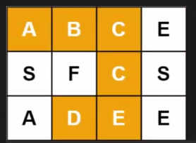
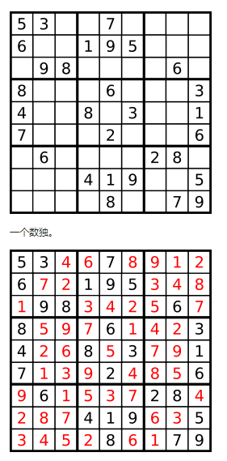
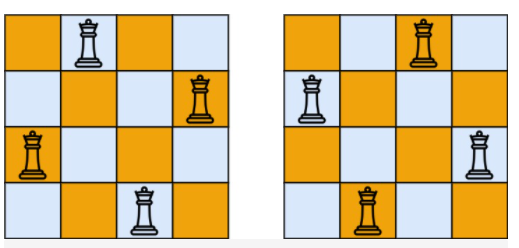

# 【关于 回溯法】那些你不知道的事

## 目录


## 一、排列问题

### 1.1 介绍

1. 给定一个序列，每一种排序表示一种结果

### 1.2 样例分析

#### 46. 全排列

##### 题意

给定一个 没有重复 数字的序列，返回其所有可能的全排列。

示例:

输入: [1,2,3]

输出:
[
  [1,2,3],
  [1,3,2],
  [2,1,3],
  [2,3,1],
  [3,1,2],
  [3,2,1]
]

##### 代码讲解

```s
    class Solution:
        def permute(self, nums: List[int]) -> List[List[int]]:
            '''
                方法：回溯法
                思路：
                    step 1：判空
                    step 2：回溯
            '''
            # step 1：判空
            res = []
            nums_len = len(nums)
            if nums_len==0:
                return res 
            # step 2：回溯
            self.dfs(nums,[],nums_len,res)
            return res 
        # 功能：回溯法
        def dfs(self,nums,path,nums_len,res):
            # step 1：终止条件判断
            if nums_len==0:
                res.append(path[:])
                return 
            # step 2：回溯所有可能
            for i in range(nums_len):
                self.dfs(nums[:i]+nums[i+1:],path+[nums[i]],nums_len-1,res)
```

#### 22. 括号生成

##### 题目

数字 n 代表生成括号的对数，请你设计一个函数，用于能够生成所有可能的并且 有效的 括号组合。

示例：

输入：n = 3

输出：[
       "((()))",
       "(()())",
       "(())()",
       "()(())",
       "()()()"
     ]

##### 代码

```s
class Solution:
    def generateParenthesis(self, n):
        self.res = []
        self.dfs(n,0,0,"")
        return self.res

    def dfs(self,n,l,r,path):
        # step 1：判断终止条件
        if len(path)==2*n:
            self.res.append(path)
            return 
        # step 2: 左括号 小于 n，那么可以继续加 （
        if l<n:
            path = path+"("
            self.dfs(n,l+1,r,path)
            path = path[:-1]
        # step 3: 左括号 大于 右括号，那么可以继续加 ）
        if l>r:
            path = path+")"
            self.dfs(n,l,r+1,path)
            path = path[:-1]
```

### 1.3 总结

1. 有序性；

## 二、组合问题

### 2.1 介绍

### 2.2 样例分析

#### 77. 组合

##### 题目

给定两个整数 n 和 k，返回 1 ... n 中所有可能的 k 个数的组合。

示例:

输入: n = 4, k = 2

输出:
[
  [2,4],
  [3,4],
  [2,3],
  [1,2],
  [1,3],
  [1,4],
]

##### 解析

```s
    class Solution:
        def combine(self, n: int, k: int) -> List[List[int]]:
            '''
                方法：回溯法
            '''
            # step 1：判空
            res = []
            if n<k:
                return res
            # step 2：回溯
            self.dfs(n,k,1,[],res)
            return res
        # 功能：回溯
        def dfs(self,n,k,start,path,res):
            # step 1：终止条件
            if len(path)==k:
                res.append(path[:])
                return 
            # step 2：回溯所有可能
            for i in range(start,n+1):
                self.dfs(n,k,i+1,path+[i],res)
```

### 2.3 总结

1. 无序性；

## 三、插板问题

### 3.1 介绍

### 3.2 样例分析

#### 131. 分割回文串

##### 题目

给定一个字符串 s，将 s 分割成一些子串，使每个子串都是回文串。

返回 s 所有可能的分割方案。

示例:

输入: "aab"

输出:
[
  ["aa","b"],
  ["a","a","b"]
]

##### 代码

```s
    class Solution:
        def partition1(self, s: str) -> List[List[str]]:
            '''
                方法：回溯法
                思路：
                    step 1 : 判空
                    step 2：回溯
            '''
            # step 1 : 判空
            s_len = len(s)
            self.res = []
            if s_len == 0:
                return self.res 
            # step 2：回溯
            self.dfs(s,0,s_len,[])
            return self.res 

        # 功能：回溯法主模块
        def dfs(self,s,start,s_len,path):
            # step 1：判断 是否 遍历结束，结束了则将 path 加入 res
            if start==s_len:
                self.res.append(path[:])
                return 
            # step 2：从 start -> s_len 做遍历
            for i in range(start,s_len):
                # step 3: 验证当前子串是否是回文串
                if not self.isPalindrome(s,start,i):
                    continue 
                # step 4：加入 path
                path.append(s[start:i+1])
                # step 5：回溯
                self.dfs(s,i+1,s_len,path)
                # step 6：弹出
                path.pop()
```

### 3.3 总结

## 四、二叉树问题

### 4.1 介绍

### 4.2 样例分析

#### 112. 路径总和

##### 题目

给定一个二叉树和一个目标和，判断该树中是否存在根节点到叶子节点的路径，这条路径上所有节点值相加等于目标和。

说明: 叶子节点是指没有子节点的节点。

示例: 
给定如下二叉树，以及目标和 sum = 22，

              5
             / \
            4   8
           /   / \
          11  13  4
         /  \      \
        7    2      1

##### 代码

```s
# Definition for a binary tree node.
# class TreeNode:
#     def __init__(self, x):
#         self.val = x
#         self.left = None
#         self.right = None

class Solution:
    def hasPathSum(self, root: TreeNode, sum: int) -> bool:
        '''
            方法：回溯法
            思路：
                step 1：判空
                step 2：回溯
        '''
        # step 1：判空
        if not root: return False 
        # step 2：回溯
        return self.dfs(root,sum)

    def dfs(self,root,target):
        '''
            方法：回溯法
            思路：
                step 1：判空
                step 2：当叶子节点的值 等于 当前 target 时，满足条件
                step 3：初实化
                step 4: 向 left 和 right 沿伸 
                step 5：测回
        '''
        # step 1：判空
        if not root: return False 
        # step 2：当叶子节点的值 等于 当前 target 时，满足条件
        if target==root.val and not root.left and not root.right:
            return True 
        # step 3：初实化
        # step 4: 向 left 和 right 沿伸 
        if root.left:
            left = self.dfs(root.left,target-root.val)
            # left 为 True,剪枝
            if left:
                return True
        if root.right:
            right = self.dfs(root.right,target-root.val)
            # right 为 True,剪枝
            if right:
                return True
        # step 5：测回
        return False
```

#### 113.路经总和II

##### 题目

给定一个二叉树和一个目标和，找到所有从根节点到叶子节点路径总和等于给定目标和的路径。

说明: 叶子节点是指没有子节点的节点。

示例:
给定如下二叉树，以及目标和 sum = 22，

              5
             / \
            4   8
           /   / \
          11  13  4
         /  \    / \
        7    2  5   1
返回:

[
   [5,4,11,2],
   [5,8,4,5]
]

##### 代码

```s
# Definition for a binary tree node.
# class TreeNode:
#     def __init__(self, x):
#         self.val = x
#         self.left = None
#         self.right = None

class Solution:
    def pathSum(self, root: TreeNode, sum: int) -> List[List[int]]:
        '''
            方法：回溯法

        '''
        # step 1：定义结果返回列表
        self.res = []
        # step 2 : root 判空
        if not root:
            return self.res 
        # step 3: 回溯
        self.dfs(root,sum,[])
        return self.res

    # 方法：回溯法
    def dfs(self,root,target,path):
        # step 1: 进栈
        path.append(root.val)
        # step 2：判断 是否满足 终止条件
        if not root.left and not root.right:
            if root.val==target:
                self.res.append(path[:])
            path.pop()
            return
        # step 3: 遍历左子树
        if root.left:
            self.dfs(root.left,target-root.val,path)
        # step 4: 遍历右子树
        if root.right:
            self.dfs(root.right,target-root.val,path)
        path.pop()
```

### 4.3 总结

1. 遍历左右子树
2. 

## 五、填坑问题
### 5.1 介绍

### 5.2 样例分析

#### 200.岛屿数量

##### 题目

给你一个由 '1'（陆地）和 '0'（水）组成的的二维网格，请你计算网格中岛屿的数量。

岛屿总是被水包围，并且每座岛屿只能由水平方向和/或竖直方向上相邻的陆地连接形成。

此外，你可以假设该网格的四条边均被水包围。


示例 1：

输入：grid = [
  ["1","1","1","1","0"],
  ["1","1","0","1","0"],
  ["1","1","0","0","0"],
  ["0","0","0","0","0"]
]
输出：1
示例 2：

输入：grid = [
  ["1","1","0","0","0"],
  ["1","1","0","0","0"],
  ["0","0","1","0","0"],
  ["0","0","0","1","1"]
]
输出：3
 

提示：

m == grid.length
n == grid[i].length
1 <= m, n <= 300
grid[i][j] 的值为 '0' 或 '1'

##### 代码

```s
class Solution:
    def numIslands(self, grid: List[List[str]]) -> int:
        res = 0
        row = len(grid)
        if row==0:
            return res 
        col = len(grid[0])
        for i in range(row):
            for j in range(col):
                if grid[i][j]=="1":
                    res = res+1
                    self.dfs(grid,i,j,row,col)
        return res

    def dfs(self,grid,x,y,row,col):
        grid[x][y]= "0"
        near_list = [(x-1,y),(x+1,y),(x,y-1),(x,y+1)]
        for i,j in near_list:
            if 0<=i<row and 0<=j<col and grid[i][j]=="1":
                self.dfs(grid,i,j,row,col)
```

#### 79. 单词搜索

##### 题目

给定一个二维网格和一个单词，找出该单词是否存在于网格中。

单词必须按照字母顺序，通过相邻的单元格内的字母构成，其中“相邻”单元格是那些水平相邻或垂直相邻的单元格。同一个单元格内的字母不允许被重复使用。

示例:

board =
[
  ['A','B','C','E'],
  ['S','F','C','S'],
  ['A','D','E','E']
]



给定 word = "ABCCED", 返回 true
给定 word = "SEE", 返回 true
给定 word = "ABCB", 返回 false
 

提示：

board 和 word 中只包含大写和小写英文字母。
1 <= board.length <= 200
1 <= board[i].length <= 200
1 <= word.length <= 10^3

##### 代码

```s
    class Solution:
        def exist(self, board: List[List[str]], word: str) -> bool:
            '''方法：回溯法
                思路：
                    step 1：判空
                    step 2：获取表格大小
                    step 3：遍历表格，找到第一个匹配的位置，然后以该位置向四周沿伸 '''
            # step 1：判空
            if len(word)==0:return True
            # step 2：获取表格大小
            board_row,board_col = len(board),len(board[0])
            # step 3：遍历表格，找到第一个匹配的位置，然后以该位置向四周沿伸
            res = False
            for i in range(0,board_row):
                for j in range(0,board_col):
                    if board[i][j]==word[0]:
                        res = self.dfs(board,word,board_row,board_col,i,j,0)
                        if res: return True 
            return res 
        def dfs(self,board,word,board_row,board_col,i,j,index):
            '''功能：回溯
                思路：回溯法经典三步走 
                    step 1: 初始化状态
                    step 2：判断是否抵达条件，抵达则表示找到答案【注：回溯法的三步走第一步】
                    step 3：向四周 沿伸，判断是否可行 【注：回溯法的三步走第二步】
                        step 3.1 向正上方沿伸
                        step 3.2 向正下方沿伸
                        step 3.3 向正左方沿伸
                        step 3.4 向正右方沿伸
                    step 4：还原状态【注：回溯法的三步走第三步】'''
            # step 1: 初始化状态
            res = False 
            # step 2：判断是否抵达条件，抵达则表示找到答案【注：回溯法的三步走第一步】
            if len(word)==index+1: return True 
            # step 3：向四周 沿伸，判断是否可行
            board[i][j] = "#"  # 由于 一个位置只能用一次，所以需要将当前位置填充，避免充分利用
            # step 3.1 向正上方沿伸
            if i-1>=0 and board[i-1][j]==word[index+1]:
                res = self.dfs(board,word,board_row,board_col,i-1,j,index+1)
                if res: return True 
            # step 3.2 向正下方沿伸
            if j-1>=0 and board[i][j-1]==word[index+1]:
                res = self.dfs(board,word,board_row,board_col,i,j-1,index+1)
                if res: return True 
            # step 3.3 向正左方沿伸
            if i<board_row-1 and board[i+1][j]==word[index+1]:
                res = self.dfs(board,word,board_row,board_col,i+1,j,index+1)
                if res: return True 
            # step 3.4 向正右方沿伸
            if j<board_col-1 and board[i][j+1]==word[index+1]:
                res = self.dfs(board,word,board_row,board_col,i,j+1,index+1)
                if res: return True
            # step 4：还原状态
            board[i][j] = word[index]
            return False
```

#### 37.解数独

##### 题目

编写一个程序，通过填充空格来解决数独问题。

一个数独的解法需遵循如下规则：

数字 1-9 在每一行只能出现一次。

数字 1-9 在每一列只能出现一次。

数字 1-9 在每一个以粗实线分隔的 3x3 宫内只能出现一次。

空白格用 '.' 表示。



##### 代码

```s
class Solution:
    def solveSudoku(self, board: List[List[str]]) -> None:
        '''
            方法：回溯法
        '''
        # 用于存储所有没填数字的位置
        res = []
        # 对 board 进行遍历，对 未填值的 点 进行回溯
        for i in range(9):
            for j in range(9):
                if board[i][j]==".":
                    res.append([i,j])
        self.dfs(board,0,res)

    # 功能：检查是否在point位置 target 是合适的
    def check(self,board,point,target):
        row = point[0]
        col = point[1]
        for i in range(9):
            # 行检验
            if i!=row and board[i][col]==target:
                return False
            # 列检验
            if i!=col and board[row][i]==target:
                return False
        # 块检验
        for i in range(row//3*3,row//3*3+3):
            for j in range(col//3*3,col//3*3+3):
                if i!=row and j !=col and board[i][j]==target:
                    return False
        return True
        
    # 功能：回溯法
    def dfs(self,board,pos,res):
        # step 1：判断终止条件
        if pos==len(res):
            return True 
        # step 2：从1-9 中 选值 填充
        for i in range(1,10):
            # step 3：验证 当前位置 为 i 是否合适
            if self.check(board,res[pos],str(i)):
                # step 4：将 值 设为 i
                board[res[pos][0]][res[pos][1]]=str(i)
                # step 5：回溯法
                if self.dfs(board,pos+1,res):
                    return True 
                # step 6：回退
                board[res[pos][0]][res[pos][1]]="."
        return False
```

#### 51. N 皇后

##### 题目

n 皇后问题 研究的是如何将 n 个皇后放置在 n×n 的棋盘上，并且使皇后彼此之间不能相互攻击。

给你一个整数 n ，返回所有不同的 n 皇后问题 的解决方案。

每一种解法包含一个不同的 n 皇后问题 的棋子放置方案，该方案中 'Q' 和 '.' 分别代表了皇后和空位。

示例 1：



输入：n = 4
输出：[[".Q..","...Q","Q...","..Q."],["..Q.","Q...","...Q",".Q.."]]
解释：如上图所示，4 皇后问题存在两个不同的解法。
示例 2：

输入：n = 1
输出：[["Q"]]
 

提示：

1 <= n <= 9
皇后彼此不能相互攻击，也就是说：任何两个皇后都不能处于同一条横行、纵行或斜线上。

##### 代码

```s
    class Solution:
        def solveNQueens(self, n: int) -> List[List[str]]:
            res = []
            chess_list = [[0 for i in range(n)] for i in range(n)]
            self._dfs(chess_list,n,0,res)
            chess_list = self.draw(n,res)
            return chess_list
        
        def _dfs(self,chess_list,n,i,res):
            if i == n:
                r = [chess[:] for chess in chess_list]
                res.append(r[:])
            else:
                for j in range(n):
                    if chess_list[i][j] == 0:
                        if self.check(chess_list,n,i,j):
                            chess_list[i][j] = 1
                            self._dfs(chess_list,n,i+1,res)
                            chess_list[i][j] = 0
                                
        def check(self,chess_list,n,i,j):
            for a in range(n):
                if chess_list[a][j] != 0:
                    return False

            for a in range(n):
                if chess_list[i][a] != 0:
                    return False
                
            # 往上正对角线
            a = i-1 
            b = j-1
            while a > -1 and b > -1:
                if chess_list[a][b] != 0:
                    return False
                a = a-1
                b = b-1
                
            # 往下正对角线
            a = i 
            b = j
            while a < n and b < n:
                if chess_list[a][b] != 0:
                    return False
                a = a+1
                b = b+1
                
            # 往上负对角线
            a = i-1 
            b = j+1
            while a > -1 and b < n:
                if chess_list[a][b] != 0:
                    return False
                a = a-1
                b = b+1
                
            # 往下负对角线
            a = i + 1
            b = j - 1
            while a < n and b > -1:
                if chess_list[a][b] != 0:
                    return False
                a = a+1
                b = b-1

            return True
        
        def draw(self,n,res):
            chess_list = []
            for r in res:
                chess = []
                for i in range(0,n):
                    s = ''
                    for j in range(0,n):
                        if r[i][j] == 1:
                            s = s + 'Q'
                        else:
                            s = s + '.' 
                    chess.append(s)
                chess_list.append(chess)
            return chess_list
```


#### 5.3 总结